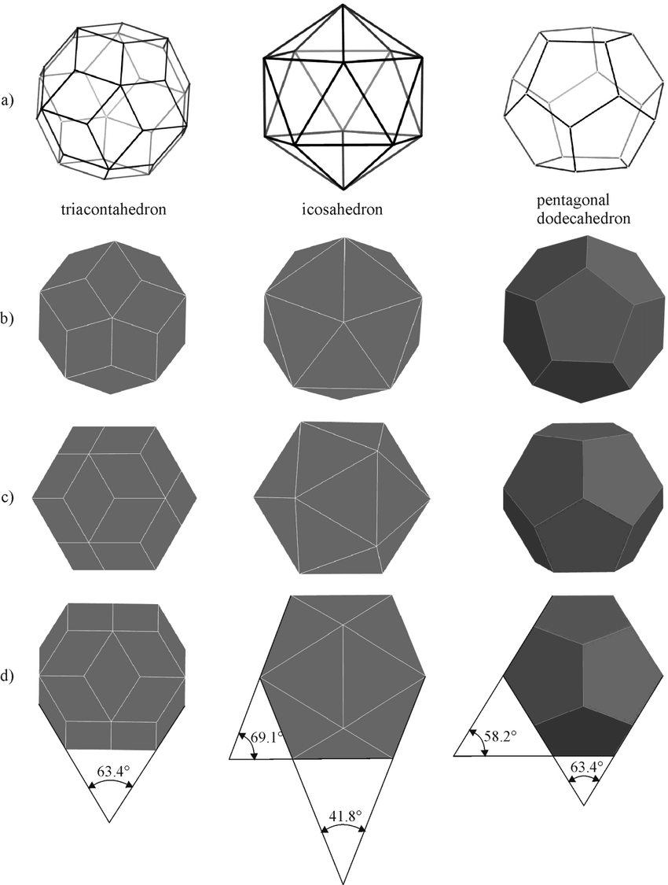

# Terrain-Generation

A procedural terrain generation project built with **C++** and modern OpenGL. This repository implements noise-based algorithms and real-time rendering techniques to create realistic and visually stunning terrains. The project leverages **ImGUI** for an interactive user interface, **GLEW** for OpenGL extensions, and **GLSL** for shader-based rendering.

---

## Features

- **Noise-Based Terrain**: Implements Perlin or other procedural noise algorithms for smooth, natural terrains.
- **Real-Time Rendering**: Powered by OpenGL and GLSL shaders for efficient 3D visualizations.
- **Interactive Controls**: Modify terrain parameters dynamically using the **ImGUI** interface.
- **Customizable Settings**: Adjust resolution, noise parameters, and rendering modes in real-time.
- **Camera Controls**: Navigate the terrain using a built-in camera system.

---

## Prerequisites

Ensure your system has the following installed:

- A C++ compiler (e.g., GCC, Clang, or MSVC)
- OpenGL 3.3+ compatible GPU and drivers
- [GLEW](http://glew.sourceforge.net/): OpenGL Extension Wrangler
- [GLFW](https://www.glfw.org/): For creating windows and handling input
- [ImGUI](https://github.com/ocornut/imgui): For user interface
- [GLM](https://github.com/g-truc/glm): For mathematics (optional, but recommended)

---

## Getting Started

### 1. Clone the Repository

```bash
git clone https://github.com/Gyakobo/Terrain-Generation.git
cd Terrain-Generation
```

### 2. Build the Project

For Linux users you can run the program with the following:

```bash 
sudo g++ -std=c++11 main.cpp src/*.cpp src/imgui/* -o main -lGLU -lglfw3 -lX11 -lXxf86vm -lXrandr -lpthread -lXi -ldl -lXinerama -lXcursor -lGL -lGLEW 

# If the previous command didn't work out then please run the following where I specifically manually added all the necessary IMGUI dependencies
sudo g++ -std=c++11 main.cpp src/*.cpp src/imgui/imgui.cpp src/imgui/imgui_impl_glfw_gl3.cpp src/imgui/imgui_demo.cpp src/imgui/imgui_draw.cpp -o main -lGLU -lglfw3 -lX11 -lXxf86vm -lXrandr -lpthread -lXi -ldl -lXinerama -lXcursor -lGL -lGLEW 

sudo ./main
```

Alternatively, please just run the [build.sh](./build.sh) after you go it executable permissions: `sudo chmod +x build.sh`

For Windows users you should just:

```bash
mkdir build && cd build
cmake ..
make
```

## Methodology

So this should be the simple usage criteria:

* **Modify Terrain Parameters**: Use the ImGUI panel to adjust noise parameters (scale, octaves, persistence) or change rendering options.

* Camera Controls:
    * W/A/S/D: Move forward/left/backward/right.
    * Mouse Drag: Rotate the camera.
    * Scroll: Zoom in/out.

* Export Screenshots: Save a snapshot of the current view (if implemented).

## Project Structure

```
Terrain-Generation/
├── src/                # Source code
│   ├── main.cpp        # Entry point
│   ├── renderer.cpp    # Rendering logic
│   ├── terrain.cpp     # Terrain generation logic
│   ├── shaders/        # GLSL shader files
├── include/            # Header files
├── resources/          # Textures, configurations
├── CMakeLists.txt      # Build configuration
└── README.md           # Project documentation
```

## Future Features

Future Features

    * [ ] Add support for advanced noise algorithms like Simplex or Worley noise
    * [ ] Implement texture mapping for more detailed terrains
    * [ ] Add water rendering with reflection/refraction effects
    * [ ] Simulate dynamic lighting and shadows
    * [ ] Support terrain export as heightmaps or 3D models

## License
MIT

<!-- ># The new and improved Viron Engine! 

## Simuliating a virus shell assembly

* 95% of human, plant and animal viruses have **icosahedral** shaped shells. Even Polio, herpes, and AIDS have icosahedral shells. These shells come in a variety of sizes depending upon the virus and are generally made up of pentagons and hexagons. 
* A virus' shell should generally be big enough to contain the genomic information, which is the RNA or DNA of the virus, should be robust enough to withstand the immune system's offences and fragile enough to break down and let the genetic material sneak in the cell.

---
## Note
* An **icosahedral** is a geometric shape with 20 sides(or faces), each composed of an equilateral triangle. An icosahedron has what is referred to as 2–3–5 symmetry, which is used to describe the possible ways that an icosahedron can rotate around an axis.


---

* "Nearly all previous research on interfering with the infection process has focused on how to prevent a fully-formed shell from binding to a cell. Our work aims at modeling how these shells build in the hopes of eventually suggesting ways of interfering with their growth and causing deformity. If this can be achieved, the genomic information won't fit inside the shell, and the virus won't be viable."

* "We have developed a hypothesis as to how virus shells form based solely on simple local rules for how proteins interact. We model virus shells as an interconnection network of proteins (i.e. nodes) and their essential binding interactions (i.e. edges). Chemically speaking, the nodes or proteins are usually all identical: however, they can be thought to behave differently because proteins can take on different shapes. We have shown that by utilizing only local communication, each node in the network can be given enough information to uniquely form any size shell. This information consists of the type of a node and its neighbors, bond angles, bond lengths, and torsional angles."

["Local rule-based theory of virus shell assembly." Proc. Natl. Acad. Sci. USA Vol. 91, pp. 7732-7736, Aug. 1994] (http://people.csail.mit.edu/bab/virus/virus.html) -->
